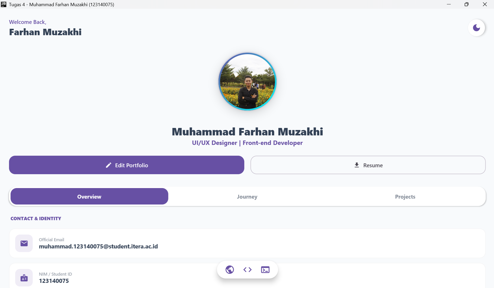
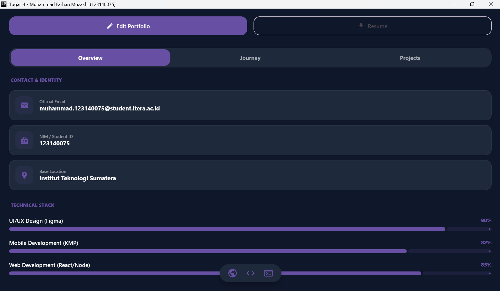
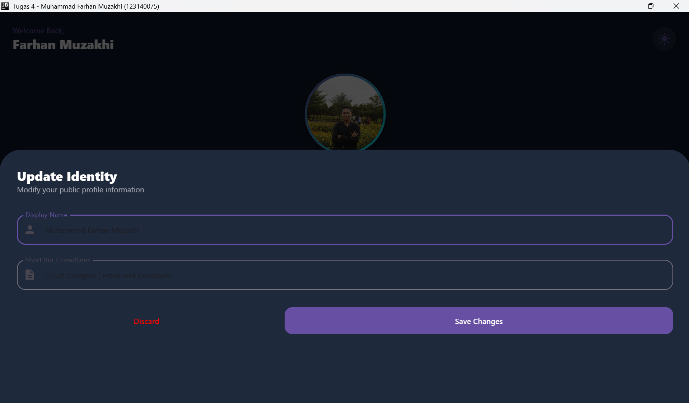
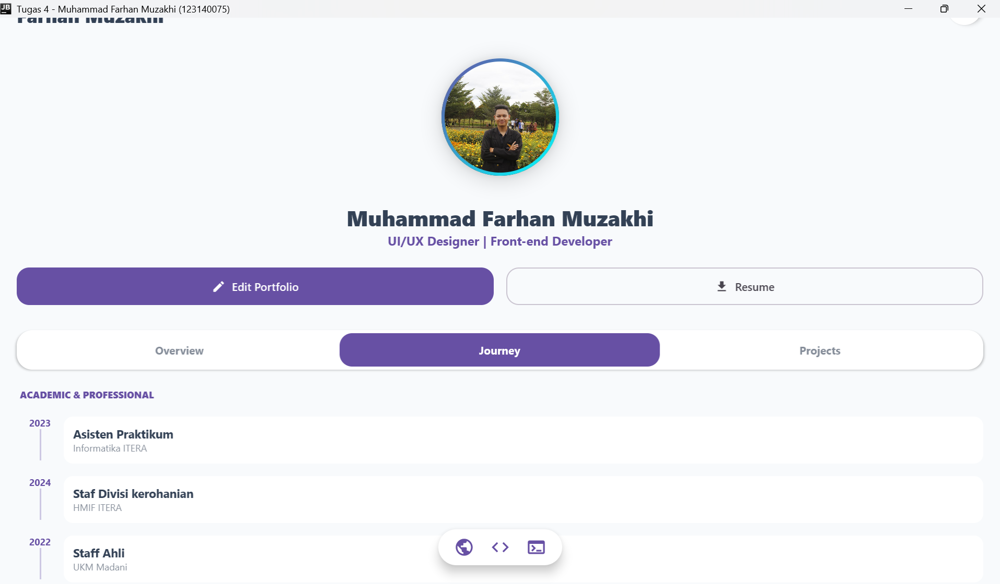

# Tugas 4 - Aplikasi Portofolio Desktop (Compose Multiplatform)

Aplikasi portofolio interaktif yang dibangun menggunakan **Compose Multiplatform** untuk target Desktop. Proyek ini mendemonstrasikan implementasi UI modern, animasi kompleks, dan manajemen state menggunakan arsitektur MVVM.

## 👤 Identitas Mahasiswa
- **Nama:** Muhammad Farhan Muzakhi
- **NIM:** 123140075
- **Program Studi:** Informatika
- **Instansi:** Institut Teknologi Sumatera (ITERA)
- **Mata Kuliah:** Pengembangan Aplikasi Mobile RA

## 🚀 Fitur Utama
- **Dynamic Glow Animation:** Efek cahaya pada foto profil yang bernapas menggunakan `rememberInfiniteTransition`.
- **Theme Management:** Mendukung Dark Mode dan Light Mode yang responsif.
- **Custom Navigation Tab:** Sistem perpindahan konten (Overview, Journey, & Stack) tanpa refresh halaman.
- **Identity Editor:** Modal interaktif untuk memperbarui informasi profil secara real-time.
- **Professional Timeline:** Menampilkan riwayat organisasi dan pengalaman asisten praktikum.

## 🛠️ Tech Stack
- **Language:** Kotlin
- **Framework:** Compose Multiplatform (Desktop)
- **Architecture:** MVVM (Model-View-ViewModel)
- **State Management:** StateFlow & Kotlin Coroutines
- **Resources:** Jetbrains Compose Resources

## 📸 Tampilan Aplikasi

### 1. Tampilan Utama (Light Mode)

*Deskripsi: Menampilkan Overview profil dengan animasi glow pada foto dan informasi kontak utama.*

### 2. Tampilan Dark Mode & Journey

*Deskripsi: Implementasi tema gelap yang nyaman di mata beserta timeline pengalaman profesional.*

### 3. Fitur Edit Profil

*Deskripsi: Overlay modal untuk mengubah data pengguna menggunakan state management yang sinkron.*
### 4. lainya

## ⚙️ Cara Menjalankan
1. Clone repositori ini.
2. Buka di Android Studio (versi Ladybug atau terbaru).
3. Pilih target run: **Desktop (jvmMain)**.
4. Klik **Run**.

---
© 2026 Muhammad Farhan Muzakhi - 123140075
