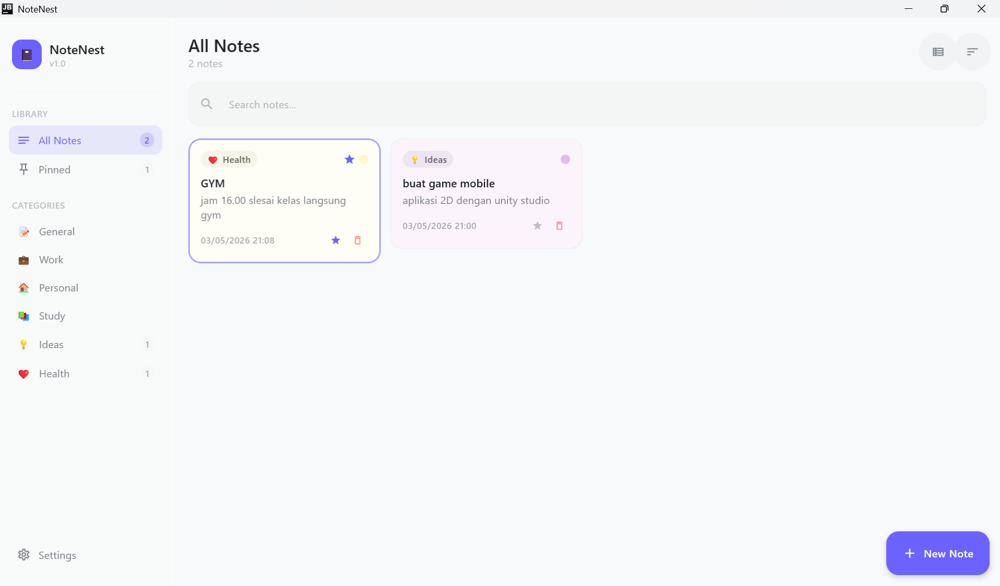
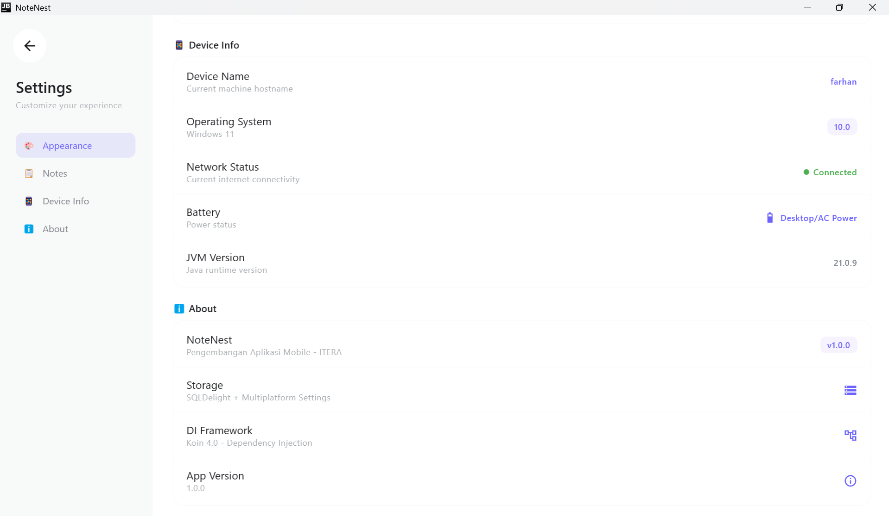
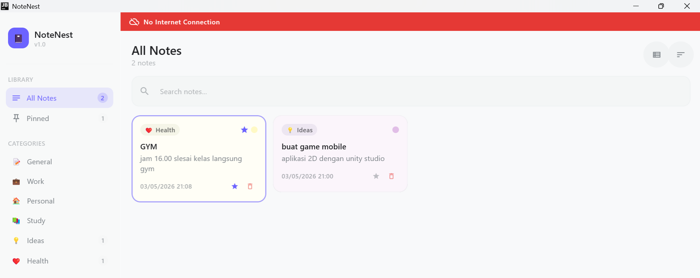
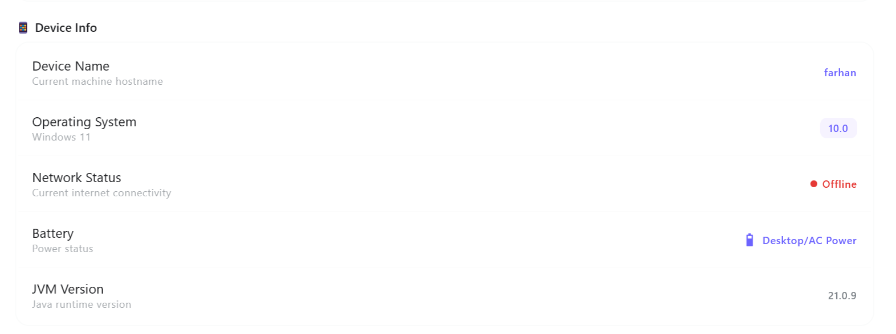

# NoteNest - Tugas 8

| | |
|---|---|
| **Nama** | Muhammad Farhan Muzakhi |
| **NIM** | 123140075 |
| **Mata Kuliah** | Pengembangan Aplikasi Mobile |
| **Pertemuan** | 8 — Platform-Specific Features |

---

## Deskripsi Aplikasi

**NoteNest** adalah aplikasi catatan desktop berbasis **Kotlin Multiplatform + Compose Desktop** yang dikembangkan dengan menambahkan fitur **platform-specific** menggunakan pattern `expect/actual`, **Dependency Injection** dengan Koin, serta akses ke **Platform APIs** seperti informasi perangkat, status jaringan, dan baterai. Aplikasi berjalan langsung di desktop (Windows/Mac/Linux) tanpa emulator.

---

## Fitur yang Diimplementasikan

| No | Fitur | Status |
|----|-------|--------|
| 1 | Koin Dependency Injection untuk seluruh app | ✅ Done |
| 2 | `DeviceInfo` dengan expect/actual | ✅ Done |
| 3 | `NetworkMonitor` dengan expect/actual | ✅ Done |
| 4 | Device Info ditampilkan di Settings screen | ✅ Done |
| 5 | Network Status Banner di main screen | ✅ Done |
| 6 | Semua dependency di-inject melalui Koin | ✅ Done |
| 7 | `BatteryInfo` dengan expect/actual **(BONUS)** | ✅ Done |

---

## Screenshot

### Tampilan Awal


### Device Info di Settings Screen


### Peringatan Offline (Banner)


### Tampilan saat Offline


---

## Video Demo

[Klik di sini untuk melihat video demo](https://drive.google.com/drive/folders/1G4dB3LdbNk5XvtRSw_jJ-cwYt3hssG2J?hl=ID)

---

## Penjelasan Implementasi

### expect/actual Pattern

Pattern ini digunakan agar common code bisa memanggil fungsi platform-specific tanpa tahu detail implementasinya. Deklarasi `expect` ada di `commonMain`, implementasi `actual` ada di `desktopMain`.

**DeviceInfo** — mengambil hostname, nama OS, versi OS, versi app, dan versi JVM:
```kotlin
// commonMain
expect class DeviceInfo() {
    fun getDeviceName(): String
    fun getOsName(): String
    fun getOsVersion(): String
    fun getAppVersion(): String
    fun getJvmVersion(): String
}
```

**NetworkMonitor** — mengecek koneksi internet dan meng-observe perubahannya lewat Flow:
```kotlin
// commonMain
expect class NetworkMonitor() {
    fun isConnected(): Boolean
    fun observeConnectivity(): Flow<Boolean>
}
```

**BatteryInfo (BONUS)** — menampilkan status baterai, mendukung Windows dan Linux:
```kotlin
// commonMain
expect class BatteryInfo() {
    fun getBatteryLevel(): Int
    fun isCharging(): Boolean
    fun getBatteryStatus(): String
}
```

---

### Koin Dependency Injection

Semua dependency didaftarkan dalam module Koin dan di-inject lewat `koinInject()` di Composable atau constructor injection di ViewModel.

```kotlin
val platformModule = module {
    single { DeviceInfo() }
    single { NetworkMonitor() }
    single { BatteryInfo() }
}

val dataModule = module {
    single { DatabaseProvider.getDatabase(get()) }
    single { NoteLocalDataSource(get()) }
    single { NoteRepository(get()) }
}

val viewModelModule = module {
    factory { NotesViewModel(get()) }
    factory { SettingsViewModel(get()) }
}
```

Koin diinisialisasi di `App.kt`:
```kotlin
@Composable
fun App(extraModules: List<Module> = emptyList()) {
    KoinApplication(application = {
        modules(appModules + extraModules)
    }) {
        AppContent()
    }
}
```

---

### Network Status Banner

Banner merah animasi yang otomatis muncul di atas MainScreen ketika koneksi internet terputus.

```kotlin
@Composable
fun NetworkStatusBanner() {
    val networkMonitor: NetworkMonitor = koinInject()
    val isConnected by networkMonitor.observeConnectivity()
        .collectAsState(initial = true)

    AnimatedVisibility(
        visible = !isConnected,
        enter = slideInVertically() + fadeIn(),
        exit = slideOutVertically() + fadeOut()
    ) {
        // Red surface with CloudOff icon
    }
}
```

---

## Struktur File Baru

```
composeApp/src/
├── commonMain/
│   └── kotlin/com/notenest/app/
│       ├── platform/
│       │   ├── DeviceInfo.kt
│       │   ├── NetworkMonitor.kt
│       │   └── BatteryInfo.kt
│       ├── di/
│       │   └── AppModule.kt
│       └── ui/components/
│           └── NetworkStatusBanner.kt
│
└── desktopMain/
    └── kotlin/com/notenest/app/
        ├── platform/
        │   ├── DeviceInfo.desktop.kt
        │   ├── NetworkMonitor.desktop.kt
        │   └── BatteryInfo.desktop.kt
        └── di/
            └── DesktopModule.kt
```

---

## Cara Menjalankan

```
.\gradlew :composeApp:run --no-configuration-cache
```

---

## Referensi

- [Kotlin Multiplatform - expect/actual](https://kotlinlang.org/docs/multiplatform-connect-to-apis.html)
- [Koin Documentation](https://insert-koin.io/docs/quickstart/kotlin)
- Materi Pertemuan 8 - Platform-Specific Features, ITERA 2025/2026
